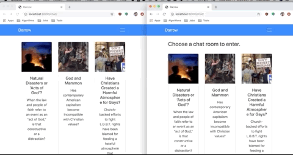

# Project Darrow

This creative project was created for GSTR 410 taught by Dr. Tyler Sergent. This is a webapp that changes topics within 3 chatrooms on a daily basis and allows users to chat freely within the application. The idea of this project is to showcase the power of anonymity by allowing users to anonymously send messages in a public chat. The class focuses on radical religions, and I wanted to show a sneak peek into what a chat of a radical religious group online.
## Getting Started

1. Clone the repo.
2. Create a virtual environment
3. Run ```pip freeze > requirements.txt.```
4. Run ```python manage.py runserver```
### Prerequisites

What things you need to install the software and how to install them

```
Python 3.5 and up
```
# Demo


## Built With

* [Django](djangoproject.com) - The web framework used
* Python 3.7

## Contributing

Please read [CONTRIBUTING.md](https://gist.github.com/PurpleBooth/b24679402957c63ec426) for details on our code of conduct, and the process for submitting pull requests to us.

## Versioning

Used Github. :)

## Authors

* **Gerardo Soto** - *Initial work* - [grrdsoto](https://github.com/grrdsoto)

See also the list of [contributors](https://github.com/your/project/contributors) who participated in this project.

## License

This project is licensed under the MIT License - see the [LICENSE.md](LICENSE.md) file for details

## Acknowledgments
* Berea College :)
